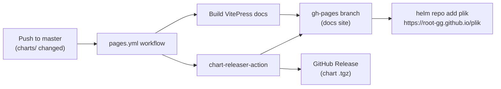

# Architecture — GitHub Actions (`.github/`)

> CI/CD workflows and automation for Plik. For system-wide overview, see the root [ARCHITECTURE.md](../ARCHITECTURE.md).

---

## Structure

```
.github/
├── workflows/
│   ├── tests.yaml              ← CI: lint, test, docs build on push/PR
│   ├── pages.yml               ← Deploy docs + publish Helm chart to gh-pages
│   ├── release.yaml            ← Build release archives, Docker images on tag push
│   ├── master.yaml             ← Post-merge actions on master
│   ├── docker-build-pr.yaml    ← Build Docker image on PR (triggered by comment)
│   └── docker-deploy-pr.yaml   ← Deploy PR image to staging (triggered by comment)
├── cr.yaml                     ← chart-releaser configuration
└── ARCHITECTURE.md             ← this file
```

---

## Workflows

### `tests.yaml` — CI Tests

Runs on every push and pull request. Steps:
1. Go lint (`make lint`)
2. Go tests (`make test`)
3. Docs build (`make docs`) — verifies VitePress builds without errors

### `pages.yml` — GitHub Pages (Docs + Helm Chart)

Runs on push to `master` when `docs/**`, `charts/**`, or the workflow itself changes. Publishes **two things** to the `gh-pages` branch:

1. **VitePress documentation** — built with `make docs`, deployed via `peaceiris/actions-gh-pages`
2. **Helm chart** — released via `helm/chart-releaser-action`, which packages charts from `charts/` and maintains `index.yaml`

> [!NOTE]
> Both docs and the Helm chart share the `gh-pages` branch because GitHub Pages only supports a single publishing source. The `keep_files: true` flag in the docs deployment step preserves the Helm `index.yaml` and chart packages.

**Configuration**: `cr.yaml` sets `skip_existing: true` so chart-releaser won't fail on already-released chart versions.

### `release.yaml` — Tagged Release Pipeline

Triggered when a GitHub release is created (tag push). Runs the full release pipeline:
1. Builds multi-arch Docker images
2. Builds release archives and client binaries
3. Uploads artifacts to the GitHub release

See [releaser/ARCHITECTURE.md](../releaser/ARCHITECTURE.md) for the build details.

### `master.yaml` — Docker Dev Build

Runs on every push to `master` (only in the `root-gg` org). Builds multi-arch Docker images and pushes `rootgg/plik:dev` to Docker Hub via `make release-and-push-to-docker-hub`. This ensures the `dev` tag always reflects the latest `master` state.

### `docker-build-pr.yaml` — PR Docker Build

Triggered by a `docker build` comment on a PR. Builds a Docker image tagged `rootgg/plik:pr-{number}` and pushes it to Docker Hub. Reports back with a comment.

### `docker-deploy-pr.yaml` — PR Docker Deploy

Triggered by a `docker deploy` comment on a PR. Deploys the PR-specific Docker image to the staging instance at `plik.root.gg`. Reports back with a deployment confirmation comment.

---

## Helm Chart Release Flow



Users install the chart via:
```bash
helm repo add plik https://root-gg.github.io/plik
helm install plik plik/plik
```

The chart source lives in `charts/plik/`. See the chart's `values.yaml` for all configuration options.
