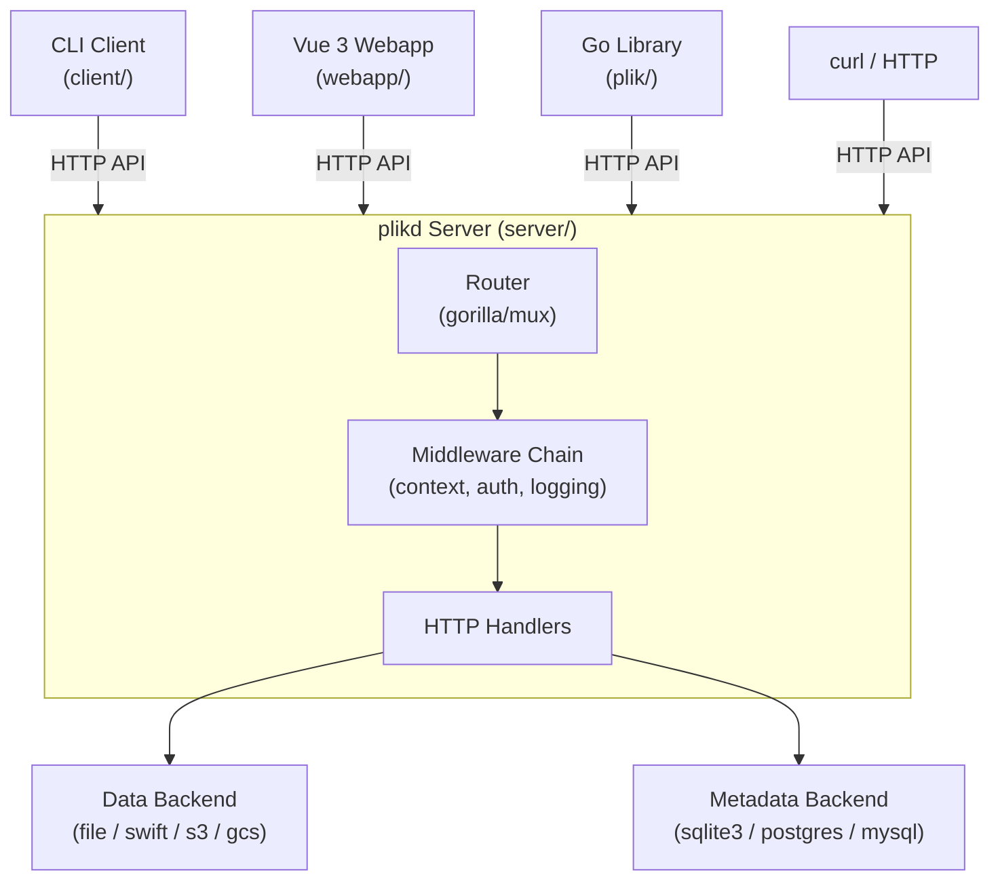
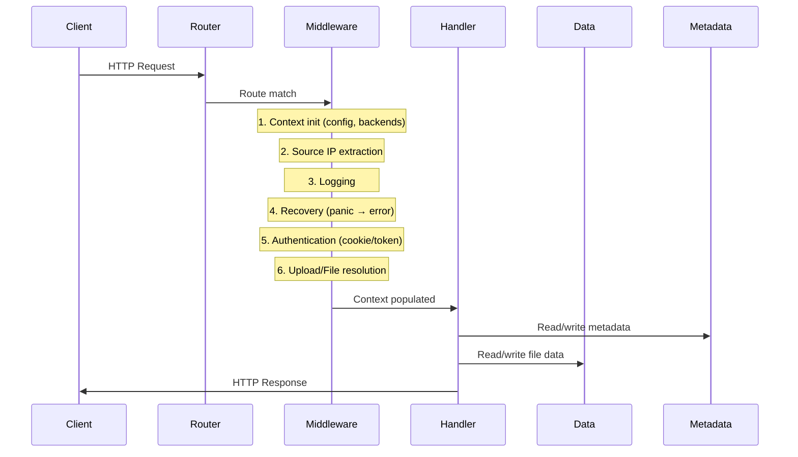
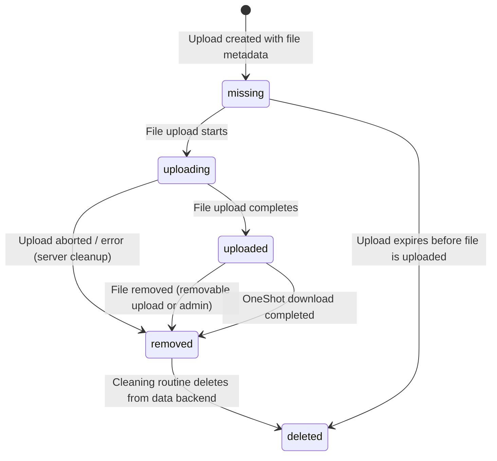

# Architecture — Plik (System-Wide)

> High-level architecture, package layering, data flows, and API reference for the entire Plik system.
> For sub-package details, see the scoped ARCHITECTURE.md in each root folder.

---

## System Overview

Plik is a temporary file upload system with three main components:

| Component | Location | Purpose |
|-----------|----------|---------|
| **Server** (`plikd`) | `server/` | Go HTTP server — REST API, middleware chain, data/metadata backends |
| **CLI Client** (`plik`) | `client/` | Multi-platform command-line uploader with archive/crypto support |
| **Webapp** | `webapp/` | Vue 3 SPA served by the server |
| **Go Library** | `plik/` | Public Go client library (used by CLI + e2e tests) |

### Core Abstractions

| Type | Package | Description |
|------|---------|-------------|
| `Upload` | `server/common` | Container for files — has TTL, options (OneShot, Stream, Removable), password protection |
| `File` | `server/common` | Individual file within an upload — has status, size, type, md5 |
| `User` | `server/common` | Authenticated user (local, Google, OVH, OIDC) — has quotas |
| `Token` | `server/common` | Upload token (UUID) — authenticates CLI clients on behalf of a user |

---

## High-Level Architecture



---

## Package Layering

Dependency direction flows left to right. Packages only import from packages to their left.

```
common → context → metadata/data → middleware → handlers → cmd → server
```

| Package | Purpose |
|---------|---------|
| `server/common` | Shared types (Upload, File, User, Token), config, feature flags, utilities |
| `server/context` | Custom request context (predates Go stdlib `context.Context`) — carries config, backends, auth state, upload/file/user through the middleware chain |
| `server/data` | `Backend` interface + implementations (file, swift, s3, gcs, stream, testing) |
| `server/metadata` | GORM-based metadata storage + migrations (via gormigrate) |
| `server/middleware` | Middleware chain: auth, logging, source IP, pagination, upload/file resolution |
| `server/handlers` | HTTP handler functions |
| `server/cmd` | CLI commands (cobra): server start, user management, import/export |
| `server/server` | HTTP server setup, router configuration, backend initialization |

---

## Request Lifecycle

Every HTTP request flows through a middleware chain before reaching a handler:



### Middleware Chains

The server defines several middleware chains composed from individual middlewares:

| Chain | Middlewares | Used For |
|-------|------------|----------|
| `emptyChain` | Context init only | `/health` |
| `stdChain` | + SourceIP, Log, Recover | Public endpoints (`/config`, `/version`) |
| `authChain` | + Authenticate(cookie), Impersonate | OAuth login endpoints |
| `tokenChain` | + Authenticate(cookie+token), Impersonate | Upload/file operations |
| `authenticatedChain` | authChain + AuthenticatedOnly | `/me/*` endpoints |
| `adminChain` | + Authenticate(cookie), AdminOnly | `/stats`, `/users`, `/uploads` |

---

## File Status State Machine

Files transition through these statuses during their lifecycle:



| Status | Constant | Downloadable? | Description |
|--------|----------|---------------|-------------|
| `missing` | `FileMissing` | No | File declared in upload but not yet uploaded (used for stream mode) |
| `uploading` | `FileUploading` | No | File upload in progress |
| `uploaded` | `FileUploaded` | **Yes** | File available for download |
| `removed` | `FileRemoved` | No | Marked for deletion, not yet cleaned |
| `deleted` | `FileDeleted` | No | Deleted from data backend |

---

## Limits & User Quota Overrides

Plik enforces limits at two levels: **server-wide defaults** (from config) and **per-user overrides** (stored on the `User` model, set by admins).

### Server-Level Limits (config)

| Config Key | Default | Description |
|------------|---------|-------------|
| `MaxFileSizeStr` | `10 GB` | Maximum size of a single file. Supports human-readable values (`"10GB"`, `"unlimited"`, `"-1"`) |
| `MaxUserSizeStr` | `-1` (unlimited) | Maximum total size of all uploads for a single user |
| `DefaultTTLStr` | `30d` (2592000s) | TTL applied when client sends `TTL = 0` |
| `MaxTTLStr` | `30d` (2592000s) | Maximum allowed TTL. `0` = no limit (infinite TTL allowed) |
| `MaxFilePerUpload` | `1000` | Maximum number of files in a single upload |

### Per-User Overrides

Each `User` has three quota fields that can be set by an admin (via `POST /user/{userID}` or `plikd user update` CLI):

| User Field | Type | Effect |
|------------|------|--------|
| `MaxFileSize` | `int64` | Overrides server `MaxFileSize` |
| `MaxUserSize` | `int64` | Overrides server `MaxUserSize` |
| `MaxTTL` | `int` | Overrides server `MaxTTL` |

### Special Values

| Value | Meaning |
|-------|---------|
| `0` | **Use server default** — the user inherits the server-wide limit |
| `-1` | **Unlimited** — no limit enforced for this user |
| `> 0` | Specific limit — used as-is, regardless of server config |

### Resolution Order

When processing a request, limits are resolved via the custom `Context`:

1. **MaxFileSize** (`Context.GetMaxFileSize()`): if `user.MaxFileSize != 0`, use it; otherwise fall back to `config.MaxFileSize`
2. **MaxUserSize** (`Context.GetUserMaxSize()`): if `user.MaxUserSize > 0`, use that cap; if `user.MaxUserSize < 0`, unlimited; if `0`, fall back to `config.MaxUserSize`. Only applies to authenticated users — anonymous uploads have no user size limit.
3. **MaxTTL** (in `Context.setTTL()`): if `user.MaxTTL != 0`, use it; otherwise fall back to `config.MaxTTL`. When `maxTTL > 0`, infinite TTL is rejected and requested TTL is capped.

> **Note**: Anonymous uploads (no token/session) use server defaults directly. Per-user overrides can be **more permissive or more restrictive** than server defaults — there is no "admin can only restrict" rule.

---

### Public Endpoints (open — no auth required)

| Method | Path | Handler | Description |
|--------|------|---------|-------------|
| GET | `/config` | `GetConfiguration` | Server config (feature flags, limits) |
| GET | `/version` | `GetVersion` | Build info |
| GET | `/qrcode` | `GetQrCode` | Generate QR code image (?url=, ?size=) |
| GET | `/health` | `Health` | Health check |

### Upload & File Endpoints (token chain — session cookie or X-PlikToken header)

| Method | Path | Handler | Auth | Description |
|--------|------|---------|------|-------------|
| POST | `/` | `AddFile` | Token | Quick upload (auto-create upload + add file) |
| POST | `/upload` | `CreateUpload` | Token | Create upload with options |
| GET | `/upload/{uploadID}` | `GetUpload` | Token | Get upload metadata |
| DELETE | `/upload/{uploadID}` | `RemoveUpload` | Token | Delete upload |
| POST | `/file/{uploadID}` | `AddFile` | Token | Add file to upload |
| POST | `/file/{uploadID}/{fileID}/{filename}` | `AddFile` | Token | Add file with known ID (stream mode) |
| DELETE | `/file/{uploadID}/{fileID}/{filename}` | `RemoveFile` | Token | Remove file |
| HEAD/GET | `/file/{uploadID}/{fileID}/{filename}` | `GetFile` | Token | Download file |
| POST | `/stream/{uploadID}/{fileID}/{filename}` | `AddFile` | Token | Stream upload |
| HEAD/GET | `/stream/{uploadID}/{fileID}/{filename}` | `GetFile` | Token | Stream download |
| HEAD/GET | `/archive/{uploadID}/{filename}` | `GetArchive` | Token | Download as zip |

### Authentication Endpoints

| Method | Path | Handler | Auth | Description |
|--------|------|---------|------|-------------|
| GET | `/auth/google/login` | `GoogleLogin` | Cookie | Get Google consent URL |
| GET | `/auth/google/callback` | `GoogleCallback` | Open | OAuth callback |
| GET | `/auth/ovh/login` | `OvhLogin` | Cookie | Get OVH consent URL |
| GET | `/auth/ovh/callback` | `OvhCallback` | Open | OAuth callback |
| GET | `/auth/oidc/login` | `OIDCLogin` | Cookie | Get OIDC consent URL |
| GET | `/auth/oidc/callback` | `OIDCCallback` | Open | OIDC callback |
| POST | `/auth/local/login` | `LocalLogin` | Cookie | Login with login/password |
| POST | `/auth/cli/init` | `CLIAuthInit` | Open | Initiate CLI device auth session |
| POST | `/auth/cli/approve` | `CLIAuthApprove` | Session | Approve CLI login (browser-side) |
| POST | `/auth/cli/poll` | `CLIAuthPoll` | Open | Poll for CLI auth result (secret required) |
| GET | `/auth/logout` | `Logout` | Open | Invalidate session |

### User Endpoints (authenticated — session cookie required)

| Method | Path | Handler | Description |
|--------|------|---------|-------------|
| GET | `/me` | `UserInfo` | Current user info |
| DELETE | `/me` | `DeleteAccount` | Delete own account |
| GET | `/me/token` | `GetUserTokens` | List tokens (paginated) |
| POST | `/me/token` | `CreateToken` | Create upload token |
| DELETE | `/me/token/{token}` | `RevokeToken` | Revoke token |
| GET | `/me/uploads` | `GetUserUploads` | List uploads (paginated) |
| DELETE | `/me/uploads` | `RemoveUserUploads` | Remove all uploads |
| GET | `/me/stats` | `GetUserStatistics` | User stats |

### User Management Endpoints (authenticated — session cookie required)

| Method | Path | Handler | Auth | Description |
|--------|------|---------|------|-------------|
| GET | `/user/{userID}` | `UserInfo` | Authenticated | Get user info |
| POST | `/user/{userID}` | `UpdateUser` | Authenticated | Update user |
| DELETE | `/user/{userID}` | `DeleteAccount` | Authenticated | Delete user |

### Admin Endpoints (admin only — session cookie + admin flag)

| Method | Path | Handler | Description |
|--------|------|---------|-------------|
| POST | `/user` | `CreateUser` | Create user |
| GET | `/stats` | `GetServerStatistics` | Server stats |
| GET | `/users` | `GetUsers` | List all users (paginated) |
| GET | `/uploads` | `GetUploads` | List all uploads (paginated) |

---

## Authentication Flows

### Session Cookie Authentication
1. User authenticates via `/auth/{provider}/login` → consent URL → `/auth/{provider}/callback`
2. Server creates JWT session cookie (`plik-session`) signed with server-generated key
3. XSRF cookie (`plik-xsrf`) must be echoed in `X-XSRFToken` header for mutating requests
4. Cookies are `Secure` when `EnhancedWebSecurity` is enabled

### Upload Token (per-upload)
1. Every upload gets a random `UploadToken` on creation (returned in the `POST /upload` response)
2. The token grants admin-like access to that specific upload — add files, remove files, delete the upload
3. This enables anonymous (non-authenticated) uploads: whoever holds the token controls the upload
4. Sent in the `X-UploadToken` header for subsequent requests on that upload

### CLI Token (per-user)
1. Authenticated user creates a CLI token via `POST /me/token`
2. Token (UUID) sent in `X-PlikToken` header or stored in `.plikrc` config
3. Authenticates CLI clients on behalf of a user — uploads are linked to the user's account for quota tracking

### CLI Device Auth Flow
1. CLI calls `POST /auth/cli/init` with hostname → receives a code, secret, and verification URL
2. User opens the verification URL in their browser and approves the login (requires session cookie)
3. CLI polls `POST /auth/cli/poll` with code + secret → receives the generated token once approved
4. Token is automatically saved to `~/.plikrc` — identical to tokens created via `POST /me/token`
5. Sessions are ephemeral (5 min TTL), one-time use, and cleaned by the background routine

### Auth Providers

| Provider | Config Keys | User ID Format |
|----------|-------------|----------------|
| Local | — (CLI-created users) | `local:{login}` |
| Google | `GoogleApiClientID`, `GoogleApiSecret` | `google:{email}` |
| OVH | `OvhApiKey`, `OvhApiSecret` | `ovh:{customerCode}` |
| OIDC | `OIDCClientID`, `OIDCClientSecret`, `OIDCProviderURL` | `oidc:{sub}` |

---

## Configuration Model

### TOML File (`plikd.cfg`)

Server configuration is a TOML file. See `server/plikd.cfg` for all options with inline comments.

### Environment Variable Override

Any config parameter can be overridden via env var using SCREAMING_SNAKE_CASE with `PLIKD_` prefix:

```bash
PLIKD_DEBUG_REQUESTS=true ./plikd
PLIKD_DATA_BACKEND_CONFIG='{"Directory":"/var/files"}' ./plikd
```

Arrays are overridden, maps are merged.

### Feature Flags

| Value | Meaning |
|-------|---------|
| `disabled` | Feature is always off |
| `enabled` | Feature is opt-in (user can turn on) |
| `default` | Feature is opt-out (on by default) |
| `forced` | Feature is always on |

### Special Values

| Value | Meaning | Used In |
|-------|---------|---------|
| `0` | Use server default | User quotas (maxFileSize, maxUserSize, maxTTL) |
| `-1` | Unlimited | User quotas |

---

## Data Backend Interface

```go
type Backend interface {
    AddFile(file *common.File, reader io.Reader) (err error)
    GetFile(file *common.File) (reader io.ReadCloser, err error)
    RemoveFile(file *common.File) (err error)  // must not fail if file not found
}
```

### Implementations

| Backend | Package | Storage |
|---------|---------|---------|
| `file` | `server/data/file` | Local filesystem directory |
| `s3` | `server/data/s3` | Amazon S3 / compatible (MinIO) — supports SSE |
| `swift` | `server/data/swift` | OpenStack Swift |
| `gcs` | `server/data/gcs` | Google Cloud Storage |
| `stream` | `server/data/stream` | In-memory pipe (uploader → downloader, nothing stored) |
| `testing` | `server/data/testing` | In-memory, for tests |

---

## Metadata Backend

GORM-based with auto-migrations via gormigrate.

| Driver | Config | Notes |
|--------|--------|-------|
| `sqlite3` | `ConnectionString = "plik.db"` | Default, standalone |
| `postgres` | Standard GORM connection string | Distributed / HA |
| `mysql` | Standard GORM connection string | Distributed / HA |

### Tables

| Table | Model | Description |
|-------|-------|-------------|
| `uploads` | `Upload` | Upload metadata, soft-deleted via `DeletedAt` |
| `files` | `File` | File metadata, FK to uploads |
| `users` | `User` | User accounts |
| `tokens` | `Token` | Upload tokens, FK to users |
| `settings` | `Setting` | Server settings (e.g., auth signing key) |
| `cli_auth_sessions` | `CLIAuthSession` | Ephemeral CLI device auth sessions (auto-cleaned) |
| `migrations` | (gormigrate) | Schema migration history |

---

## Documentation

Plik maintains two layers of documentation for different audiences:

### Human-Readable Docs (`docs/`)

A [VitePress](https://vitepress.dev/) site deployed to GitHub Pages. Built with Vue 3 and Vite.

```
docs/
├── .vitepress/config.js   ← site config (nav, sidebar, search)
├── index.md               ← landing page (hero + features)
├── guide/                 ← getting started, configuration, security
├── features/              ← CLI client, web UI, authentication
├── backends/              ← data and metadata backend setup
├── reference/             ← HTTP API, Prometheus metrics, Go library
├── operations/            ← reverse proxy, cross-compilation
├── architecture/          ← links to in-repo ARCHITECTURE.md files
└── contributing.md        ← dev setup and build instructions
```

- **Build**: `make docs` (or `cd docs && npm run dev` for local dev server)
- **Deploy**: Automated via `.github/workflows/deploy-docs.yml` on push to `master`
- **CI**: Build is verified on every push/PR via `.github/workflows/tests.yaml`

**Build pipeline** (`make docs`):

1. `inject_version.sh` — replaces `__VERSION__` placeholders in markdown files with the current version from `gen_build_info.sh`. Only runs in CI (`$CI` env var); skipped locally to avoid dirtying source files.
2. `copy_architecture.sh` — copies each `ARCHITECTURE.md` from the repo into `docs/architecture/` with cross-link rewriting. These generated files are `.gitignored`.
3. `npm run build` — runs the VitePress build (includes dead link checking).

### Agent-Readable Docs (`ARCHITECTURE.md` files)

Scoped `ARCHITECTURE.md` files placed in each package directory, designed for AI coding assistants. Each file documents internal structure, key abstractions, data flow, and design decisions. See the list below.

### Changelog (`changelog/`)

One file per version tag (e.g., `changelog/1.3.8`). Used by `gen_build_info.sh` to build the release history exposed via `GET /version` and displayed in the web UI's update notification.

---

## Scoped Architecture Docs

For deeper details on each component:

- [server/ARCHITECTURE.md](server/ARCHITECTURE.md) — Server internals
- [client/ARCHITECTURE.md](client/ARCHITECTURE.md) — CLI client
- [plik/ARCHITECTURE.md](plik/ARCHITECTURE.md) — Go library
- [webapp/ARCHITECTURE.md](webapp/ARCHITECTURE.md) — Vue 3 SPA
- [testing/ARCHITECTURE.md](testing/ARCHITECTURE.md) — Backend integration tests
- [releaser/ARCHITECTURE.md](releaser/ARCHITECTURE.md) — Release pipeline
