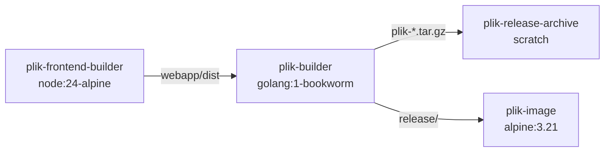

# Architecture — Releaser (`releaser/`)

> Release tooling for building distribution archives and Docker images. For system-wide overview, see the root [ARCHITECTURE.md](../ARCHITECTURE.md).

---

## Structure

```
releaser/
├── release.sh    ← top-level entry point: orchestrates multi-arch Docker build + optional push
└── releaser.sh   ← runs inside Docker: builds clients, server, and assembles the release archive
```

Supporting files referenced by the release process:

```
server/gen_build_info.sh   ← generates version, git info, client manifest as JSON
changelog/                 ← one file per version tag (used to build release history in build info)
Dockerfile                 ← multi-stage build: frontend → Go cross-compile → release archive → runtime image
```

---

## Release Pipeline

### Entry Points (Makefile)

| Target | Command | Description |
|--------|---------|-------------|
| `make release` | `releaser/release.sh` | Build release archives locally (no push) |
| `make release-and-push-to-docker-hub` | `PUSH_TO_DOCKER_HUB=true releaser/release.sh` | Build + push multi-arch Docker images |
| `make docker` | `docker buildx build --load -t rootgg/plik:dev .` | Quick local Docker image (single arch) |

### `release.sh` — Orchestrator

Runs on the **host machine**. Orchestrates the entire release from the project root:

1. **Version detection**: Calls `server/gen_build_info.sh version` to extract the version from the latest git tag (`git describe --tags --abbrev=0`)
2. **Mint check**: Verifies the git repo is clean (`mint=true` = no uncommitted changes). Warns if dirty.
3. **Release check**: Verifies HEAD matches the version tag (`release=true`). Warns if untagged.
4. **Build archives**: Runs `docker buildx build` targeting the `plik-release-archive` stage, outputting `.tar.gz` archives to `releases/`
5. **Checksums**: Generates `sha256sum.txt` for all release archives
6. **Docker push** (optional): If `PUSH_TO_DOCKER_HUB` is set, builds the final Docker image stage and pushes with tags:
   - `rootgg/plik:dev` (always)
   - `rootgg/plik:{version}` (only if `release=true`)
   - `rootgg/plik:latest` (only if `release=true` **and** version contains no `-` suffix, e.g. `-RC1`, `-alpha`, `-test` all prevent tagging as latest)

#### Environment Variables

| Variable | Default | Description |
|----------|---------|-------------|
| `DOCKER_IMAGE` | `rootgg/plik` | Docker Hub image name |
| `TAG` | `dev` | Docker tag for non-release builds |
| `TARGETS` | `linux/amd64,linux/i386,linux/arm64,linux/arm` | Target platforms for Docker buildx |
| `CLIENT_TARGETS` | *(from releaser.sh default)* | Override client cross-compilation targets |
| `CC` | *(auto-detected)* | Override cross compiler |
| `PUSH_TO_DOCKER_HUB` | *(unset)* | If set, push images to Docker Hub |

### Dockerfile — Multi-Stage Build



| Stage | Base | Purpose |
|-------|------|---------|
| `plik-frontend-builder` | `node:24-alpine` | Builds Vue webapp (`make clean-frontend frontend`) |
| `plik-builder` | `golang:1-bookworm` | Cross-compiles all clients + server via `releaser/releaser.sh` |
| `plik-release-archive` | `scratch` | Extracts `.tar.gz` archives (used with `--output` for local builds) |
| `plik-image` | `alpine:3.21` | Runtime image — copies `release/` directory, runs `plikd` as non-root user (UID 1000) |

### `releaser.sh` — Builder (runs inside Docker)

Called by the Dockerfile inside `plik-builder`. Performs the actual compilation:

1. **Clean**: Runs `make clean`
2. **Verify frontend**: Asserts `webapp/dist` exists (copied from the frontend builder stage)
3. **Build clients**: Iterates over `CLIENT_TARGETS` (comma-separated `OS/ARCH` pairs), cross-compiling the Go CLI client for each. Generates MD5 checksums per binary. Also copies the bash client (`client/plik.sh`)
4. **Build server**: Cross-compiles the server binary with `CGO_ENABLED=1` using the appropriate cross compiler:
   - `amd64` → native
   - `386` → `i686-linux-gnu-gcc`
   - `arm` → `arm-linux-gnueabi-gcc`
   - `arm64` → `aarch64-linux-gnu-gcc`
5. **Assemble release**: Creates a `release/` directory containing:
   ```
   release/
   ├── clients/           ← all cross-compiled client binaries + MD5 checksums + bash client
   ├── changelog/         ← version changelog files
   ├── webapp/dist/       ← built web frontend
   └── server/
       ├── plikd           ← server binary
       └── plikd.cfg       ← default config
   ```
6. **Create archive**: Packages everything as `plik-{version}-{os}-{arch}.tar.gz`

#### Default Client Targets

```
darwin/amd64, freebsd/386, freebsd/amd64, linux/386, linux/amd64,
linux/arm, linux/arm64, openbsd/386, openbsd/amd64, windows/amd64, windows/386
```

Note: The Makefile `clients` target also invokes `releaser.sh` but exits early via `MAKEFILE_TARGET=clients` before building the server or creating the archive.

---

## Version & Build Info (`gen_build_info.sh`)

This script generates build metadata consumed by the server at startup and exposed via `GET /version`.

### Modes

| Argument | Output |
|----------|--------|
| `version` | Just the version string (from `git describe --tags`) |
| `info` | Human-readable one-liner |
| `base64` | Full JSON, base64-encoded (embedded as ldflags at compile time) |
| *(none)* | Full JSON to stdout |

### Generated JSON

```json
{
  "version": "1.3.8",
  "date": 1707000000,
  "user": "builder",
  "host": "buildhost",
  "goVersion": "go1.26 linux/amd64",
  "gitShortRevision": "abc1234",
  "gitFullRevision": "abc1234567890...",
  "isRelease": true,
  "isMint": true,
  "clients": [
    { "name": "Linux 64bit", "md5": "...", "path": "clients/linux-amd64/plik", "os": "linux", "arch": "amd64" }
  ],
  "releases": [
    { "name": "1.3.8", "date": 1707000000 }
  ]
}
```

Key fields:
- **`isRelease`**: `true` if HEAD commit matches the version tag — controls whether Docker Hub gets `:{version}` tag (and `:latest` for stable releases, i.e. versions without a `-` suffix)
- **`isMint`**: `true` if the working tree is clean (no uncommitted changes) — release.sh warns if dirty
- **`clients`**: Enumerated from `clients/` directory, used by the web UI to display download links
- **`releases`**: Built from `changelog/` directory entries matched against git tags

---

## How to Cut a Release

1. Update `changelog/{version}` with release notes
2. Commit and tag: `git tag {version}`
3. Run `make release` to build archives locally, or `make release-and-push-to-docker-hub` to also push Docker images
4. Upload `releases/*.tar.gz` and `releases/sha256sum.txt` to GitHub Releases
