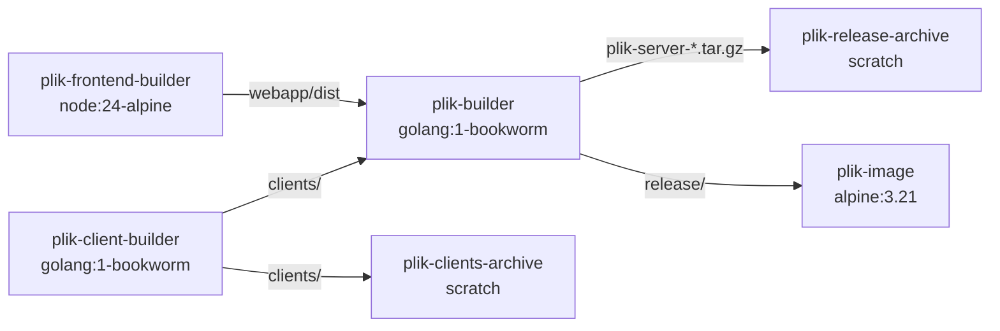

# Architecture — Releaser (`releaser/`)

> Release tooling for building distribution archives and Docker images. For system-wide overview, see the root [ARCHITECTURE.md](../ARCHITECTURE.md).

---

## Structure

```
releaser/
├── release.sh              ← top-level entry point: orchestrates multi-arch Docker build + optional push
├── helm_release.sh         ← packages Helm chart + updates gh-pages index.yaml
├── build_clients.sh        ← builds CLI client binaries for all target platforms (pure Go cross-compilation)
└── build_server_release.sh ← runs inside Docker: builds server and assembles the release archive
```

Supporting files referenced by the release process:

```
server/gen_build_info.sh   ← generates version, git info, client manifest as JSON
changelog/                 ← one file per version tag (used to build release history in build info)
Dockerfile                 ← multi-stage build: frontend → clients → Go cross-compile → release archive → runtime image
```

---

## Release Pipeline

### Entry Points (Makefile)

| Target | Command | Description |
|--------|---------|-------------|
| `make release` | `releaser/release.sh` | Build release archives + client binaries locally (no push) |
| `make release-and-push-to-docker-hub` | `PUSH_TO_DOCKER_HUB=true releaser/release.sh` | Build + push multi-arch Docker images |
| `make docker` | `docker buildx build --load -t rootgg/plik:dev .` | Quick local Docker image (single arch) |
| `make clients` | `releaser/build_clients.sh` | Build CLI clients for all platforms |

### `release.sh` — Orchestrator

Runs on the **host machine**. Orchestrates the entire release from the project root:

1. **Version detection**: Calls `server/gen_build_info.sh version` to extract the version from the latest git tag (`git describe --tags --abbrev=0`)
2. **Mint check**: Verifies the git repo is clean (`mint=true` = no uncommitted changes). Warns if dirty.
3. **Release check**: Verifies HEAD matches the version tag (`release=true`). Warns if untagged.
4. **Export clients**: Runs `docker buildx build` targeting `plik-clients-archive`, renames binaries to `plik-{version}-{os}-{arch}[.exe]` in `releases/`
5. **Build archives**: Runs `docker buildx build` targeting `plik-release-archive`, outputting `.tar.gz` archives to `releases/`
6. **Checksums**: Generates `sha256sum.txt` for all release artifacts (archives + client binaries)
7. **Docker push** (optional): If `PUSH_TO_DOCKER_HUB` is set, builds the final Docker image stage and pushes with tags:
   - `rootgg/plik:dev` (always)
   - `rootgg/plik:{version}` (only if `release=true`)
   - `rootgg/plik:preview` (only if `release=true` — tracks the latest release including pre-releases)
   - `rootgg/plik:latest` (only if `release=true` **and** version contains no `-` suffix, e.g. `-RC1`, `-alpha`, `-test` all prevent tagging as latest)

#### Environment Variables

| Variable | Default | Description |
|----------|---------|-------------|
| `DOCKER_IMAGE` | `rootgg/plik` | Docker Hub image name |
| `TAG` | `dev` | Docker tag for non-release builds |
| `TARGETS` | `linux/amd64,linux/i386,linux/arm64,linux/arm` | Target platforms for Docker buildx |
| `CLIENT_TARGETS` | *(from build_clients.sh default)* | Override client cross-compilation targets |
| `CC` | *(auto-detected)* | Override cross compiler |
| `PUSH_TO_DOCKER_HUB` | *(unset)* | If set, push images to Docker Hub |
| `RELEASE` | *(auto)* | Set to `false` to explicitly disable release tagging (e.g. in PR builds) |

### Dockerfile — Multi-Stage Build



| Stage | Base | Platform | Purpose |
|-------|------|----------|---------|
| `plik-frontend-builder` | `node:24-alpine` | `$BUILDPLATFORM` | Builds Vue webapp (`make clean-frontend frontend`) |
| `plik-client-builder` | `golang:1-bookworm` | `$BUILDPLATFORM` | Builds all CLI clients via `releaser/build_clients.sh` (runs once, pure Go) |
| `plik-builder` | `golang:1-bookworm` | `$BUILDPLATFORM` | Cross-compiles server via `releaser/build_server_release.sh`, using pre-built clients and webapp |
| `plik-clients-archive` | `scratch` | — | Exports bare client binaries (used with `--output` by `release.sh`) |
| `plik-release-archive` | `scratch` | — | Exports `.tar.gz` archives (used with `--output` for local builds) |
| `plik-image` | `alpine:3.21` | per-platform | Runtime image — copies `release/` directory, runs `plikd` as non-root user (UID 1000) |

> **Optimization**: Client binaries are pure Go cross-compilations (no CGO) and produce identical output regardless of host platform. Building them once in `plik-client-builder` and sharing across all platform stages avoids redundant compilation (previously 4× per client target).

### `build_clients.sh` — Client Builder

Builds CLI client binaries for all target platforms. Can run standalone or inside Docker:

1. **Iterate targets**: Loops over `CLIENT_TARGETS` (comma-separated `OS/ARCH` pairs)
2. **Cross-compile**: For each target, sets `GOOS`/`GOARCH` and runs `make client`
3. **Output**: Creates `clients/<os>-<arch>/plik[.exe]` + `MD5SUM` per binary, plus `clients/bash/plik.sh`

#### Default Client Targets

```
darwin/amd64, freebsd/386, freebsd/amd64, linux/386, linux/amd64,
linux/arm, linux/arm64, openbsd/386, openbsd/amd64, windows/amd64, windows/386
```

### `build_server_release.sh` — Server Builder (runs inside Docker)

Called by the Dockerfile inside `plik-builder`. Performs server compilation and release assembly:

1. **Clean**: Runs `make clean`
2. **Verify frontend**: Asserts `webapp/dist` exists (copied from the frontend builder stage)
3. **Verify clients**: Asserts `clients/` exists (copied from the client builder stage)
4. **Build server**: Cross-compiles the server binary with `CGO_ENABLED=1` using the appropriate cross compiler:
   - `amd64` → native
   - `386` → `i686-linux-gnu-gcc`
   - `arm` → `arm-linux-gnueabi-gcc`
   - `arm64` → `aarch64-linux-gnu-gcc`
5. **Assemble release**: Creates a `release/` directory containing:
   ```
   release/
   ├── clients/           ← all cross-compiled client binaries + MD5 checksums + bash client
   ├── changelog/         ← version changelog files
   ├── webapp/dist/       ← built web frontend
   └── server/
       ├── plikd           ← server binary
       └── plikd.cfg       ← default config
   ```
6. **Create archive**: Packages everything as `plik-server-{version}-{os}-{arch}.tar.gz`

---

## Version & Build Info (`gen_build_info.sh`)

This script generates build metadata consumed by the server at startup and exposed via `GET /version`.

### Modes

| Argument | Output |
|----------|--------|
| `version` | Just the version string (from `git describe --tags`) |
| `info` | Human-readable one-liner |
| `base64` | Full JSON, base64-encoded (embedded as ldflags at compile time) |
| *(none)* | Full JSON to stdout |

### Generated JSON

```json
{
  "version": "1.3.8",
  "date": 1707000000,
  "user": "builder",
  "host": "buildhost",
  "goVersion": "go1.26 linux/amd64",
  "gitShortRevision": "abc1234",
  "gitFullRevision": "abc1234567890...",
  "isRelease": true,
  "isMint": true,
  "clients": [
    { "name": "Linux 64bit", "md5": "...", "path": "clients/linux-amd64/plik", "os": "linux", "arch": "amd64" }
  ],
  "releases": [
    { "name": "1.3.8", "date": 1707000000 }
  ]
}
```

Key fields:
- **`isRelease`**: `true` if HEAD commit matches the version tag — controls whether Docker Hub gets `:{version}` + `:preview` tags (and `:latest` for stable releases, i.e. versions without a `-` suffix)
- **`isMint`**: `true` if the working tree is clean (no uncommitted changes) — release.sh warns if dirty
- **`clients`**: Enumerated from `clients/` directory, used by the web UI to display download links
- **`releases`**: Built from `changelog/` directory entries matched against git tags

---

## `helm_release.sh` — Helm Chart Packager

Called by the `release.yaml` GitHub Actions workflow after `release.sh`. Takes the release tag as argument:

1. **Replace placeholders**: Substitutes `__VERSION__` in `Chart.yaml` with the release tag (unified versioning)
2. **Package chart**: Runs `helm package`, producing `plik-helm-{tag}.tgz` in `releases/`
3. **Update Helm repo index**: Fetches existing `index.yaml` from `gh-pages`, merges the new chart entry via `helm repo index --merge`, and commits the updated `index.yaml` back to `gh-pages`

The packaged `.tgz` file is left in `releases/` so it gets uploaded alongside other release artifacts by the workflow.

Set `DRY_RUN=true` to test locally — packages the chart, generates `index.yaml`, prints both, then reverts `Chart.yaml`.

---

## How to Cut a Release

1. Update `changelog/{version}` with release notes
2. Create a release from GitHub (this creates the tag)
3. The `release` GitHub Actions workflow runs automatically — it builds archives, client binaries, Docker images, packages the Helm chart, updates the Helm repo index, and uploads everything to the release page

> The Helm chart version is automatically synchronized with the release tag — no manual `Chart.yaml` update needed.

## Testing the Release Process Locally

The release build uses `docker buildx` for multi-platform images. The default Docker driver does **not** support multi-platform builds. You need to create a builder first:

```bash
docker buildx create --name plik-builder --use
```

Then run the full release locally:

```bash
make release
```

For a quick **single-platform** test (no special builder needed):

```bash
TARGETS=linux/amd64 make release
```
